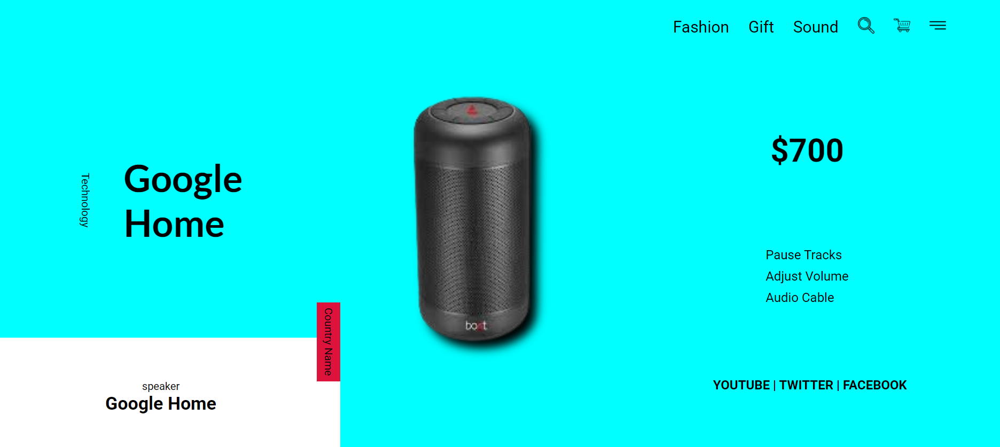

### 🖥️Speaker Interface – Google Home UI

### 📌 Project Overview

This project is a modern, minimalistic Google Home speaker interface designed with a clean layout and vibrant colors. The design emphasizes both visual appeal and usability, offering a sleek UI that showcases product details, features, and price effectively.

### 📸 Demo Preview

Here’s a snapshot of the Google Home speaker interface design:

### 🚀 Features

🖼️ High-resolution product display (Google Home speaker)

💸 Price highlight with bold visibility

🎵 Key functionalities listed (Pause Tracks, Adjust Volume, Audio Cable)

🔗 Social media footer with links to YouTube, Twitter, Facebook

🛒 Top-right navigation bar with icons for search, cart, and menu

🧭 Top menu with categories: Fashion, Gift, Sound

🔠 Creative use of typography and vertical text orientation

### 🛠️ Technologies Used

HTML

CSS

JavaScript 

### 🎯 Objective

To design a visually engaging and intuitive product interface suitable for an e-commerce or product showcase website. Focused on combining aesthetic design with user-friendly layout principles.

### 📁 File Structure
📁 speaker-interface/
│
├── index.html        # Main HTML file
├── styles.css        # Stylesheet for layout and design
├── assets/
│   └── images/       # Product image (Google Home speaker)

### 🔍 Live Preview

You can view the live project here:  
👉 [https://your-project-name.netlify.app](https://clinquant-kashata-12f940.netlify.app)
